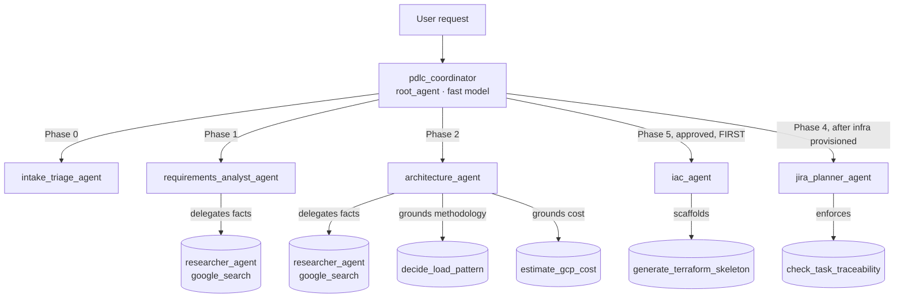

# Agentic PDLC Assistant — EPAM Gemini Enterprise Hackathon (Stream 2)

> **Team:** `agenti-1711` (Agentic PDLC) · **Stream 2** — High-Code / Custom Agents & MCP

## 1. Executive Summary

The **Agentic PDLC Assistant** automates the data-engineering **Project Development Lifecycle (PDLC)** end to end — as if a real GCP data-engineering team took a plain-language business request (e.g. *"build a daily competitor stock tracker"*) all the way to a deliverable pipeline. It produces the concrete artifacts a senior team would: a **triage note**, a versioned **Requirement Analysis with gap/blocker detection**, a **GCP-native High-Level Design with a cost proposal** and **Architecture Decision Records**, an **approved-design JIRA breakdown**, and **Infrastructure-as-Code scaffolding** — not just documents, a path to something a developer can actually run.

It is a **multi-agent system** on Google's **Agent Development Kit (ADK)**: a lightweight coordinator routes each request to a narrow **phase specialist**. Specialists ground every *factual* claim (vendor/API capabilities, current GCP service limits) in **live Google Search research** via a dedicated researcher sub-agent — never from memory — while the one genuinely-fixed methodology decision (the load-pattern decision tree) stays a **deterministic tool**. Costs are estimated with a labeled rough-order-of-magnitude calculator, framed like a lead engineer proposing options to the business. It is deployed to **Cloud Run (A2A)** and registered into **Gemini Enterprise**.

**Business value:** compresses days of senior-engineer discovery, design, and cost justification into minutes, while producing a defensible **paper trail** — every choice traces back to a requirement, a researched fact, or an ADR. That combination (speed *and* auditability *and* a runnable deliverable) is what makes it enterprise-ready rather than a demo.

## 2. Architecture

Coordinator-Dispatcher pattern — one root agent routes to phase specialists, each with a limited scope and tool set (limited-scope agents are more reliable and hallucinate less than one monolithic agent). Two specialists further delegate factual research to a dedicated `google_search`-grounded researcher sub-agent (real web grounding, GCP-native, no external SaaS).




## 3. Tech Stack & Dependencies

- **Language:** Python 3.12
- **Framework:** Google ADK 2.8 (`google-adk[a2a]`), A2A protocol, `sse-starlette`
- **Toolchain:** `agents-cli`, `uv`, `pytest`
- **GCP:** Cloud Run, Vertex AI (Gemini), Artifact Registry, Cloud Build, Secret Manager, Cloud Trace
- **Grounding (planned, GCP-native):** Google Developer Knowledge MCP + Vertex AI Search

## 4. Environment Variables

| Variable | Description | Required | Default |
| :--- | :--- | :--- | :--- |
| `GOOGLE_CLOUD_PROJECT` | GCP sandbox project ID (Layer 2) | Yes | `hl2-gcpp-ccoe-ge-h-agenti-1711` |
| `GOOGLE_CLOUD_LOCATION` | GCP region | No | `us-central1` |
| `CLOUD_RUN_SERVICE_NAME` | Cloud Run service name | No | `agenti-1711-pdlc` |
| `PDLC_FAST_MODEL` | Model for coordinator routing | No | `gemini-2.5-flash` |
| `PDLC_MODEL` | Model for JIRA/IaC specialists | No | `gemini-2.5-flash` |
| `PDLC_REASONING_MODEL` | Model for research + gap analysis (Phase 1) and GCP design reasoning (Phase 2) | No | `gemini-2.5-pro` |
| `PDLC_MAX_TOOL_CALLS` | Per-turn tool-call ceiling (guardrail) | No | `10` |

No secrets live in the repo — `.env` is git-ignored; production secrets use **Secret Manager**.

## 5. Local Execution & Testing

```bash
python -m venv .venv && source .venv/Scripts/activate   # bash/Linux: .venv/bin/activate
pip install -r requirements-dev.txt -r pdlc_agent/requirements.txt
python -m pytest                        # deterministic tool tests (fast, offline)
source .env && ./deploy.sh local        # ADK dev UI at http://localhost:8000 (needs GCP auth)
```


## 6. Deployment & CI/CD

Full runbook (first-time bootstrap → connectivity → IAM → deploy → registration): **[docs/deployment.md](docs/deployment.md)**.

```bash
source .env && ./deploy.sh cloud_run    # Cloud Run + A2A, epam-policy-compliant (--no-allow-unauthenticated)
```

The script deploys the container, then grants the Layer-1 Gemini Enterprise Discovery Engine SA `roles/run.invoker`. Registering the A2A endpoint into the shared Gemini Enterprise app is **team-gated** (Layer 1) — raise a support ticket with the deployed `pdlc_agent/agent.json` + service URL.

## 7. Testing & Verification (UAT)

Testing split follows the ADK guidance: **deterministic tools → `pytest`** (`tests/unit`); **agent behavior → `agents-cli eval`** (never assert on LLM response text in pytest).

| Sample prompt | Expected behavior |
| :--- | :--- |
| *"Here's our raw request for a daily competitor stock tracker — what's missing before we can build?"* | Routes to **requirements_analyst** → full gap/blocker analysis (Requirement Analysis doc), grounded facts via the researcher sub-agent |
| *"Compare the cost of a lightweight vs enterprise-Airflow pattern for this volume."* | Routes to **architecture_agent** → `estimate_gcp_cost` comparison + GCP-native pattern recommendation |
| *"Full, incremental, or append-only for daily stock closes with corporate actions?"* | Routes to **architecture_agent** → append-only + Delta/BigQuery MERGE, traceable ADR rationale |
| *"The architecture is approved — scaffold the infra for it."* | Routes to **iac_agent** → Terraform written to `infra/generated/<slug>/`, honestly flags anything unverified |

## Repository Layout

```
pdlc_agent/              ADK package — root_agent = pdlc_coordinator
├── agent.py             coordinator (routes to 5 phase specialists)
├── config.py            env-driven models (fast/model/reasoning) + guardrail limits
├── callbacks.py         tool-call ceiling guardrail
├── agents/              intake_triage · requirements_analyst · architecture · jira_planner · iac · researcher
├── tools/               load_pattern · cost_estimate · traceability · requirement_doc · iac_generator
├── agent.json           A2A agent card (5 skills)
└── requirements.txt     runtime deps (installed into the container)
tests/unit/              deterministic tool + guardrail tests — 24 passing
docs/                    playbook · architecture · deployment
.github/skills/          vendored Google ADK + Cloud skills (agents-cli golden path)
deploy.sh                local | cloud_run | agent_engine
```

## License / IP

All artifacts produced during the hackathon remain the intellectual property of EPAM, per the event terms.
