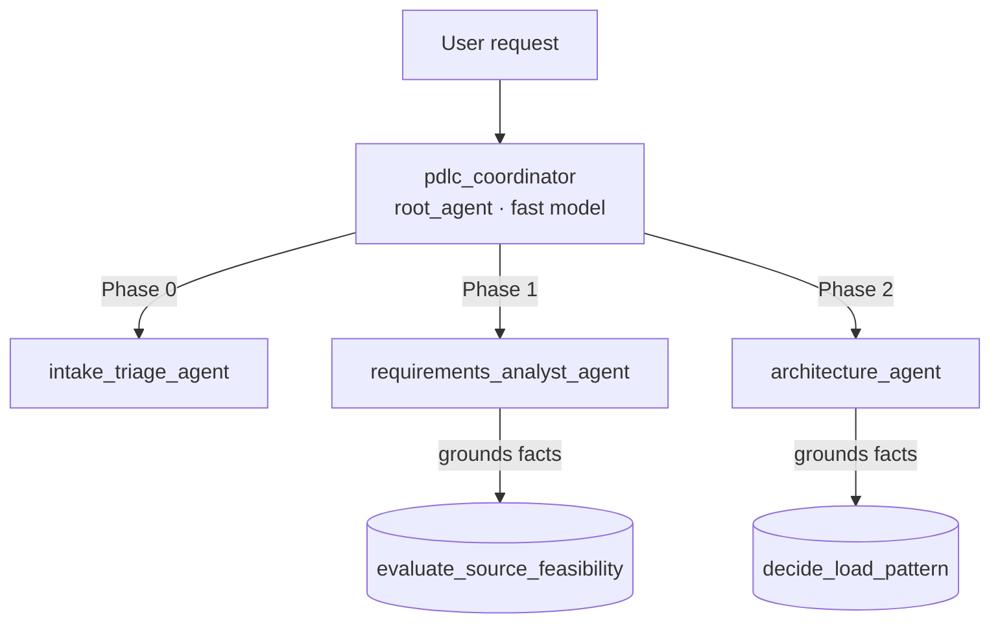

# Agentic PDLC Assistant — EPAM Gemini Enterprise Hackathon (Stream 2)

> **Team:** `agenti-1711` (Agentic PDLC) · **Stream 2** — High-Code / Custom Agents & MCP

## 1. Executive Summary

The **Agentic PDLC Assistant** automates the data-engineering **Project Development Lifecycle (PDLC)** — it turns a plain-language data request (e.g. *"build a daily competitor stock tracker"*) into the concrete lifecycle artifacts a senior data engineer would produce: a **triage note**, a versioned **Requirement Analysis**, a **High-Level Design** with **Architecture Decision Records**, and a **JIRA breakdown**.

It is a **multi-agent system** on Google's **Agent Development Kit (ADK)**: a lightweight coordinator routes each request to a narrow **phase specialist**, and every specialist grounds its output in **deterministic decision tools** rather than free-form LLM guessing — so decisions are traceable, reproducible, and hallucination-resistant. It is deployed to **Cloud Run (A2A)** and registered into **Gemini Enterprise**.

**Business value:** compresses days of senior-engineer discovery and design into minutes, while producing a defensible **paper trail** — every choice traces back to a requirement or an ADR. That combination (speed *and* auditability) is what makes it enterprise-ready rather than a demo.

## 2. Architecture

Coordinator-Dispatcher pattern — one root agent routes to phase specialists, each with a limited scope and tool set (limited-scope agents are more reliable and hallucinate less than one monolithic agent).




## 3. Tech Stack & Dependencies

- **Language:** Python 3.12
- **Framework:** Google ADK 2.8 (`google-adk[a2a]`), A2A protocol, `sse-starlette`
- **Toolchain:** `agents-cli`, `uv`, `pytest`
- **GCP:** Cloud Run, Vertex AI (Gemini), Artifact Registry, Cloud Build, Secret Manager, Cloud Trace
- **Grounding (planned, GCP-native):** Google Developer Knowledge MCP + Vertex AI Search

## 4. Environment Variables

| Variable | Description | Required | Default |
| :--- | :--- | :--- | :--- |
| `GOOGLE_CLOUD_PROJECT` | GCP sandbox project ID (Layer 2) | Yes | `hl2-gcpp-ccoe-ge-h-agenti-1711` |
| `GOOGLE_CLOUD_LOCATION` | GCP region | No | `us-central1` |
| `CLOUD_RUN_SERVICE_NAME` | Cloud Run service name | No | `agenti-1711-pdlc` |
| `PDLC_FAST_MODEL` | Model for coordinator routing | No | `gemini-2.5-flash` |
| `PDLC_MODEL` | Model for phase specialists | No | `gemini-2.5-flash` |
| `PDLC_MAX_TOOL_CALLS` | Per-turn tool-call ceiling (guardrail) | No | `10` |

No secrets live in the repo — `.env` is git-ignored; production secrets use **Secret Manager**.

## 5. Local Execution & Testing

```bash
python -m venv .venv && source .venv/Scripts/activate   # bash/Linux: .venv/bin/activate
pip install -r requirements-dev.txt -r pdlc_agent/requirements.txt
python -m pytest                        # deterministic tool tests (fast, offline)
source .env && ./deploy.sh local        # ADK dev UI at http://localhost:8000 (needs GCP auth)
```


## 6. Deployment & CI/CD

Full runbook (first-time bootstrap → connectivity → IAM → deploy → registration): **[docs/deployment.md](docs/deployment.md)**.

```bash
source .env && ./deploy.sh cloud_run    # Cloud Run + A2A, epam-policy-compliant (--no-allow-unauthenticated)
```

The script deploys the container, then grants the Layer-1 Gemini Enterprise Discovery Engine SA `roles/run.invoker`. Registering the A2A endpoint into the shared Gemini Enterprise app is **team-gated** (Layer 1) — raise a support ticket with the deployed `pdlc_agent/agent.json` + service URL.

## 7. Testing & Verification (UAT)

Testing split follows the ADK guidance: **deterministic tools → `pytest`** (`tests/unit`); **agent behavior → `agents-cli eval`** (never assert on LLM response text in pytest).

| Sample prompt | Expected behavior |
| :--- | :--- |
| *"We need a daily competitor stock tracker — where do we start?"* | Routes to **intake_triage** → one-paragraph triage note + proceed/fast-track decision |
| *"Is Alpha Vantage viable for 10 calls/day?"* | Routes to **requirements_analyst** → grounded verdict: viable, 25/day ceiling, 15-min delay |
| *"Full, incremental, or append-only for daily stock closes with corporate actions?"* | Routes to **architecture_agent** → append-only + Delta + MERGE, with a traceable ADR rationale |

## Repository Layout

```
pdlc_agent/              ADK package — root_agent = pdlc_coordinator
├── agent.py             coordinator (routes to phase specialists)
├── config.py            env-driven models + guardrail limits
├── callbacks.py         tool-call ceiling guardrail
├── agents/              phase specialists: intake_triage · requirements_analyst · architecture
├── tools/               deterministic decision tools: load_pattern · feasibility
├── agent.json           A2A agent card
└── requirements.txt     runtime deps (installed into the container)
tests/unit/              deterministic tool + guardrail tests
docs/                    playbook · architecture · deployment
.github/skills/          vendored Google ADK + Cloud skills (agents-cli golden path)
deploy.sh                local | cloud_run | agent_engine
```

## License / IP

All artifacts produced during the hackathon remain the intellectual property of EPAM, per the event terms.
