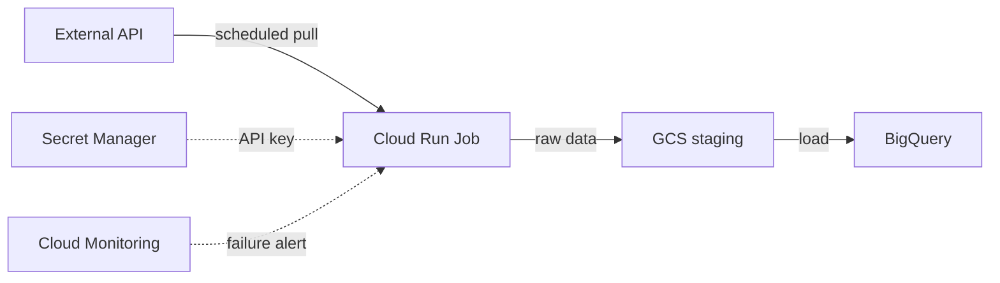

# Data Platform Architecture Pattern — GCP Ingestion Standard

**Status:** Approved · **Owner:** Data Engineering (Agentic PDLC) · **Last updated:** 2026-08-30

## Overview

This is the default architecture pattern the `architecture_agent` grounds its recommendations in for new ingestion pipelines — the GCP-native equivalent of an org's internal Confluence standard. All new pipelines should follow it unless a documented business requirement justifies deviation (see "When to deviate" below). This is authored and version-controlled in the repo rather than an external wiki — see [docs/architecture.md](architecture.md) §6 for why.

**Stack:**

| Layer | Technology |
|---|---|
| Orchestration | Managed Service for Apache Airflow (MSAA / Cloud Composer) for multi-step DAGs; **Cloud Scheduler + Cloud Run Jobs** for simple single-step pulls (the default for most requests — see "When to deviate") |
| Staging | Google Cloud Storage (GCS) |
| Data Warehouse | BigQuery |
| Transformation | Dataform (GCP-native, git-integrated, dbt-equivalent) — or dbt-core on BigQuery if the team already has a dbt codebase |
| BI / Reporting | Power BI (already licensed) or Looker Studio (free, GCP-native) |

## Architecture Diagram (default, lightweight pattern)

## Layer 1 — Orchestration

**Default:** Cloud Scheduler triggers a Cloud Run Job on a cron schedule. Handles retry and failure alerting for the job.

**When multiple pipelines share dependencies / a modeling layer already exists:** Managed Service for Apache Airflow (MSAA, formerly Cloud Composer) — coordinates scheduled extraction, triggers downstream Dataform/dbt runs once staging lands, retry/failure alerting across many DAGs.

**Convention:** each ingestion source gets its own job/DAG named `ingest_<source_name>`. Tasks must be idempotent — safe to re-run without duplicating data.

## Layer 2 — Staging (GCS)

All raw data lands in GCS before anything else happens — a durable, replayable copy of raw source data, cleanly separated from transformed data, and reprocessable if a downstream bug is found.

**Convention:** bucket paths follow `gs://<bucket>/<source>/<yyyy>/<mm>/<dd>/`, partitioned by ingestion date.

## Layer 3 — Data Warehouse (BigQuery)

Data moves from GCS into BigQuery via `bq load` / a load job referencing the GCS URI, using a service account (least-privilege IAM) rather than static credentials.

**GCP-specific note:** BigQuery natively supports MERGE/UPSERT — you often do not need a separate Delta/Iceberg lakehouse layer just for update-in-place semantics (see [docs/pdlc-playbook.md](pdlc-playbook.md) §2.1).

Layers inside BigQuery:
- **Raw** — unmodified copy of what landed in GCS.
- **Staging / Intermediate / Marts** — built by Dataform/dbt (Layer 4).

## Layer 4 — Transformation (Dataform or dbt)

Standard three-layer model:
- **Staging** — one model per source table, light cleaning only (renaming, type casting, no joins).
- **Intermediate** — reusable building blocks joined into business entities. Not queried directly.
- **Marts** — final business-facing tables the BI tool queries.

**Naming convention:** Staging `stg_<source>__<object>`; Intermediate `int_<entity>__<transformation>`; Marts `fct_<event>` (facts) or `dim_<entity>` (dimensions).

## Layer 5 — Reporting (Power BI / Looker Studio)

Import mode is the default for daily-refresh dashboards; DirectQuery only when near-real-time numbers are explicitly required (adds warehouse query load per view).

## Security

- No credentials hardcoded in jobs, Dataform/dbt profiles, or GCS access — all cross-service auth uses least-privilege IAM service accounts.
- API keys/tokens live in **Secret Manager**, referenced by the job's runtime service account — never committed to source control.

## Monitoring

- Job/DAG failures alert via Cloud Monitoring to the team's notification channel.
- Dataform/dbt test (assertion) failures block downstream mart builds — a failing test halts the pipeline rather than letting bad data into marts.

## When to deviate from this pattern

This is a default, not a strict requirement. Document any deviation with the business reason:
- **Small volume, single source (10s–1000s rows/day):** the lightweight orchestration default (Cloud Scheduler + Cloud Run Jobs) already applies — this is not a deviation, it's the default fit.
- **Volumes genuinely need Spark-scale transforms:** Dataproc (managed Spark) is justified.
- **Big volumes, append-mostly, no merges:** Dataflow (Apache Beam) + BigLake/BigQuery external tables over GCS Parquet.
- Any deviation must be called out explicitly in the pipeline's own architecture doc (see [`architecture_agent`](../pdlc_agent/agents/architecture_agent.py)), with a reference back to this standard.

## References

- [Cloud Composer overview](https://cloud.google.com/composer/docs/concepts/overview)
- [BigQuery — batch loading data](https://cloud.google.com/bigquery/docs/batch-loading-data)
- [Dataform documentation](https://cloud.google.com/dataform/docs)
- [Cloud Scheduler documentation](https://cloud.google.com/scheduler/docs)
- [Cloud Run Jobs documentation](https://cloud.google.com/run/docs/create-jobs)
