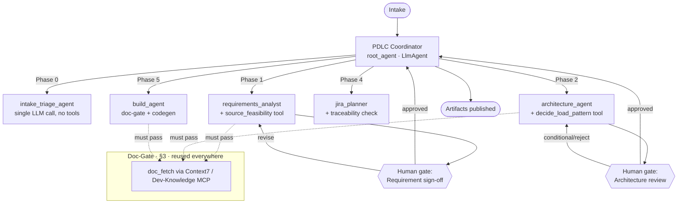

# PDLC Harness — GCP / ADK Architecture

**Google ADK orchestration · ADK + MCP tool layer · Cloud Trace + Agent Platform observability · doc-grounded, hallucination-resistant by construction.**

This is the GCP-native re-architecture of the original LangGraph/LangChain/LangSmith harness. The *design principles* are unchanged; every framework primitive is migrated to its Google ADK / Google Cloud equivalent. See [pdlc-playbook.md](pdlc-playbook.md) for the domain process this harness automates.

> **Grounding note (we eat our own dog food):** ADK, `agents-cli`, and the MCP toolset ship fast. Every ADK API named here is grounded in the vendored `google-agents-cli-adk-code` skill, but treat exact signatures as *illustrative* — the build agent must confirm them against the skill references / ADK docs before writing real code. That discipline is the whole point of §3.

---

## 0. Design contract (non-negotiables)

1. **Doc-before-code, structurally enforced.** No agent emits code, config, or a framework-specific call without a documentation-retrieval step *preceding it in the same turn*. Not a prompt instruction — a structural gate (§3).
2. **Human-in-the-loop at both playbook gates** — Phase 1→2 sign-off and the Phase 3 architecture review. The flow cannot proceed past these without a recorded human decision (§5).
3. **MCP-first for anything external; ADK-native tools only for internal glue.** If a capability exists as an MCP server (Jira, Confluence, GitHub, BigQuery), use it via an ADK MCP toolset — not a hand-rolled API wrapper (§6).
4. **Every run traced; "grounding" is an automated eval gate, not a hope.** Cloud Trace captures every step; an `agents-cli eval` metric checks that every code-producing step had a doc-fetch immediately before it. A run that fails does not ship (§7).

---

## 1. LangChain-ecosystem → GCP/ADK migration map

The single most important table in this doc. Every concept from the original harness, and where it lands on Google Cloud:

| Original (LangChain ecosystem) | GCP / ADK equivalent | Skill / reference |
|---|---|---|
| LangGraph `StateGraph` (hierarchical supervisor) | ADK **Coordinator-Dispatcher** (`LlmAgent` + `sub_agents`) for interactive routing; ADK **graph `Workflow`** (2.0: nodes/edges/`START`, routes) for explicit phase topology | `google-agents-cli-adk-code` (`adk-python.md`, `adk-workflows.md`) |
| LangGraph deterministic pipeline | ADK `SequentialAgent` / `ParallelAgent` / `LoopAgent` | `adk-python.md` §3 |
| `PDLCState` (TypedDict) threaded through graph | ADK **`session.state`** (shared dict), `output_key` to write, `{state_key}` to inject | `adk-python.md` §4 |
| Checkpointer (`PostgresSaver`/`SqliteSaver`) for durable pause/resume | ADK **Session Service**: in-memory (dev) → **Agent Platform Sessions** (Agent Runtime) or **Cloud SQL** (Cloud Run); `Workflow` resume via `rerun_on_resume` | `adk-workflows.md`, `google-agents-cli-deploy` |
| `langchain-mcp-adapters` `MultiServerMCPClient` | ADK **MCP toolset** (`McpToolset`) binding MCP servers as tools | `adk-python.md` §4 (MCP) |
| Context7 doc-MCP (external library docs) | **Google Developer Knowledge MCP** + **Vertex AI Search** grounding (GCP-native; Context7 only if Platform-Architect-approved — it is external SaaS) | `google-cloud-solution-build-deploy-agents` |
| LangChain-native internal tools | ADK **`FunctionTool`** (plain typed Python fn) — e.g. our `decide_load_pattern` | `adk-python.md` §2 |
| LangGraph `interrupt()` HITL | ADK graph **human-input node** / long-running tool; interactively, the Gemini Enterprise chat turn *is* the gate | `adk-workflows.md` (human-in-the-loop) |
| LangSmith tracing | **Cloud Trace** (ADK OpenTelemetry) + **Agent Platform** traces + **BigQuery Agent Analytics** | `google-agents-cli-observability` |
| LangSmith CI-gated grounding evaluator | **`agents-cli eval`** custom metric / LLM-as-judge (Quality Flywheel) | `google-agents-cli-eval`, `agent-platform-eval-flywheel` |
| Deploy target (self-managed) | **Cloud Run** (A2A) or **Vertex AI Agent Runtime** (ADK native) | `google-agents-cli-deploy`, `cloud-run-basics` |
| "Register in the app" | **Gemini Enterprise registration** — `agents-cli publish gemini-enterprise` (in this hackathon: via support ticket, §9) | `google-agents-cli-publish` |
| Secrets in env / `.env` | **Secret Manager** (prod), `.env` git-ignored (dev only) | `google-cloud-waf-security` |
| IaC (implicit) | **Terraform** in `infra/` | `google-agents-cli-deploy` (terraform-patterns) |

---

## 2. Top-level topology

Hierarchical coordinator, not swarm — the PDLC is built around a **paper trail** (Requirement doc → ADR log → review decision → JIRA tree → PR), so we keep it centralized and auditable: one specialist per phase reporting to one coordinator, one place the state and trace live.



Phase 0 (Intake/Triage) is a lightweight node inside the coordinator; Phase 3 (review) *is* Gate 2 — a decision point, not agent work.

**Interactive vs. batch.** For Gemini Enterprise chat, the coordinator (`LlmAgent` + `sub_agents`) routes a single request to one phase specialist — this is what's built today. For a full unattended run across all phases with hard gates, the same specialists are wired as nodes in an ADK graph `Workflow` (§5). Same agents, two drivers.

---

## 3. The Doc-Gate pattern (the anti-hallucination mechanism)

The direct answer to "don't let agents hallucinate code — read live docs first," as a **structural rule**, not a prompt. In ADK, structure = ordering + a callback guard, instead of LangGraph's single-incoming-edge.

**Mechanism — two layers:**
- A doc-fetch step runs before any agent that produces code, config, or an ADR "Decision". It calls **Context7 MCP** (external libraries: ADK, BigQuery/Delta MERGE syntax, the stock API SDK) and the **Google Developer Knowledge MCP** (official GCP grounding), then appends each fetch to `state["doc_grounding_log"]`.
- A `before_tool_callback` / `before_model_callback` **guard** refuses to let a codegen tool run unless a matching grounding entry exists in state for the libraries in scope.

Two ADK ways to make codegen *structurally* reachable only after doc-fetch:

```python
# Option A — SequentialAgent: codegen physically follows doc-fetch.
from google.adk.agents import SequentialAgent
build_agent = SequentialAgent(
    name="build_agent",
    sub_agents=[doc_fetch_agent, codegen_agent],  # order is the gate
)

# Option B — graph Workflow: single incoming edge, no bypass (mirrors LangGraph).
# edges = [('START', plan_libs), (plan_libs, doc_gate), (doc_gate, generate_code)]
```

The guard makes it enforceable rather than merely ordered:

```python
def before_tool_require_grounding(tool, args, tool_context):
    """Refuse codegen unless the libraries in scope were doc-fetched this run."""
    if tool.name in CODEGEN_TOOLS:
        grounded = {g["library"] for g in tool_context.state.get("doc_grounding_log", [])}
        missing = set(args.get("libraries_in_scope", [])) - grounded
        if missing:
            raise RuntimeError(f"Doc-gate: no doc fetch for {missing}; fetch before codegen.")
```

This same doc-gate is reused in Phase 2 (verify a framework can do what an ADR proposes *before* writing the ADR) and Phase 5 (verify the exact current API before generating pipeline code) — one component, not rebuilt per phase.

---

## 4. Shared state (ADK `session.state`)

Every artifact from the playbook's Appendix A is a field. Written with `output_key`, injected downstream with `{state_key}`, persisted by the Session Service.

```python
# Illustrative shape of session.state threaded through the run.
{
  "request_id": str, "requester": str, "triage_note": str,
  # Phase 1
  "requirement_doc": dict, "requirement_doc_version": str,   # "v1.0" -> "v1.1"
  "open_questions": list, "source_evaluations": list,        # per-source: auth/limits/cost/delay/verdict
  "requirement_signoff": str,                                # pending|approved|revise
  # Phase 2
  "architecture_pattern": str,                               # A_enterprise_dw|B_lakehouse_glue|C_lakehouse_emr|D_lightweight
  "adr_log": list, "hld_mermaid": str, "nfr_design": dict,
  "architecture_review": str, "review_conditions": list,     # pending|approved|conditional|rejected
  # Phase 4/5
  "jira_tree": dict,
  "doc_grounding_log": list,                                 # every doc fetch — the §7 evaluator checks THIS
  "test_results": dict, "deployment_status": str,            # dev|integration|uat|production
}
```

`doc_grounding_log` is the field that doesn't exist in a normal ADK app — it exists so the grounding evaluator (§7) checks something concrete, not free-text traces.

---

## 5. Human-in-the-loop gates

Two gates, both recording a decision into state before the flow proceeds.

- **Interactive (Gemini Enterprise chat):** the gate is the conversation. The coordinator presents the Requirement doc / HLD and waits for the user's "approve" or "revise" in the next turn; the decision is written to `requirement_signoff` / `architecture_review`.
- **Unattended (graph `Workflow`):** a human-input node pauses the graph durably (state persisted by the Session Service → survives restart); the decision arrives as a routed event (`approve` / `conditional` / `reject`). A rejected review can resume from the post-Phase-1 checkpoint instead of re-deriving everything.

No auto-approve path exists by default — loosening a gate is a deliberate topology change, not a silent one.

---

## 6. MCP inventory & binding

**EPAM guardrail (hackathon KB):** external, non-GCP SaaS MCP servers (Context7, Atlassian, GitHub) are **not default-approved** — they require Platform-Architect sign-off. So the default harness is **GCP-native**, and phases that would "publish to Confluence / create Jira tickets" instead **emit the artifact into the repo (GitLab)** for a human to consume. External MCPs are an opt-in upgrade, gated on sign-off.

**Static** (every run) vs **dynamic** (bound to the `architecture_pattern` from Phase 2).

| MCP / tool | Category | Used by | Compliance |
|---|---|---|---|
| Google Developer Knowledge MCP | Static | Phase 1/2/5 grounding | ✅ GCP-native — **primary doc-gate source** |
| Vertex AI Search (grounding) | Static | Phase 1/2 citations | ✅ GCP-native |
| BigQuery | Dynamic (A/C/D) | Phase 5 schema/query during build/test | ✅ GCP-native |
| Context7 | Static | external library docs | ⚠️ sign-off required; else rely on Dev-Knowledge MCP |
| Atlassian / GitHub | Static | ticketing / PR | ⚠️ sign-off required; else emit artifacts to GitLab |

All bound via ADK's MCP toolset. **Binding an MCP server *into Gemini Enterprise* is the ticket-gated step (§8)** — but our agent *consuming* MCP tools internally needs no ticket.

---

## 7. Observability & the grounding gate

**A. Tracing (set once, applies everywhere).** ADK emits OpenTelemetry → **Cloud Trace**; every LLM call, tool call (including each doc fetch), and agent transition is one nested trace keyed by `request_id`. Prompt/response logging and **BigQuery Agent Analytics** add token/latency analytics. See `google-agents-cli-observability`.

**B. The grounding evaluator (operationalizes the "strict rule" as code).** An `agents-cli eval` metric, run on the remote, fails a case where a codegen step has no preceding doc fetch for its libraries — checked against `doc_grounding_log`, not inferred from text. Wired as a **CI-gated eval**, a failing `grounding_check` blocks the PR the same way a failing unit test would. This is the difference between "we told it to check docs" and "a run where it didn't cannot ship." See `agent-platform-eval-flywheel`.

> Division of test types (from the ADK skill): **pytest = deterministic tools only** (e.g. `decide_load_pattern`); **agent behavior = `agents-cli eval` datasets**. Never assert on LLM response text in pytest.

---

## 8. Deployment & Gemini Enterprise binding

1. **Deploy (we do it, on the remote):** Cloud Run with A2A (`adk deploy cloud_run … --a2a`) or Vertex AI Agent Runtime (`agents-cli deploy`). Secrets from Secret Manager; least-privilege service account.
2. **Grant invoker:** Discovery Engine SA gets `roles/run.invoker` on the Cloud Run service (already scripted in `deploy.sh`).
3. **Bind / register (ticket-gated):** `agents-cli publish gemini-enterprise` wires the deployed A2A endpoint / Agent Runtime resource into the shared Gemini Enterprise app. In this hackathon we **raise a support ticket** with the `agent.json` + service URL (or Agent Runtime resource name) — teams lack direct console access. **This is the only externally-blocked step, and it does not block build/deploy/iterate.**

---

## 9. Phased build plan (build inside-out; test each slice)

**MVP scope (what we demo):** the full PDLC flow end-to-end with **GCP-native grounding** (Google Developer Knowledge MCP) and each phase **emitting its artifact as a repo file** (requirement doc, ADR, HLD, JIRA tree). No external SaaS. **Deferred upgrades (documented, not built for MVP):** real Jira ticket creation and Confluence publishing via your **own** Atlassian Cloud site (per hackathon-team advice — the org Confluence is too locked-down to connect in time), plus Context7 for external-library docs — all gated on Platform-Architect sign-off and each a small change thanks to the clean MCP seams. Deferring them costs nothing demoable while keeping the seams shows extensibility.

| # | Slice | Status |
|---|---|---|
| 1 | Coordinator + one phase specialist (`architecture_agent`) grounded in a deterministic tool (`decide_load_pattern`); tool-call guardrail; unit tests | ✅ **done** |
| 2 | `intake_triage_agent` (Phase 0) + `requirements_analyst` (Phase 1) with a deterministic `source_feasibility` tool (verified API facts) | ⏭️ next |
| 3 | Doc-gate (§3): bind Context7 / Dev-Knowledge MCP; grounding guard callback; prove doc-fetch precedes any capability claim | ⏭️ |
| 4 | HITL Gate 1 (requirement sign-off) via the chat turn; then Gate 2 | ⏭️ |
| 5 | `jira_planner` (Phase 4) with traceability check (every task cites a requirement/ADR id) | ⏭️ |
| 6 | Observability (Cloud Trace) + `agents-cli eval` dataset incl. the grounding metric | ⏭️ |
| 7 | Terraform `infra/` + Secret Manager + Cloud Run/Agent Runtime deploy (remote) | ⏭️ |
| 8 | Raise the Gemini Enterprise binding ticket; end-to-end pilot on the stock-tracker request | ⏭️ |

Keep both human gates strict initially; loosen only after traces show trustworthy behavior.

---

## 10. Repo layout (target)

```
demo_agent/                     # ADK package (kept for deploy.sh / agent.json compatibility)
├── agent.py                    # root_agent = PDLC Coordinator  ✅
├── config.py                   # env-driven models + limits      ✅
├── callbacks.py                # tool-call ceiling; doc-gate guard ✅/⏭️
├── agents/                     # phase specialists
│   ├── architecture_agent.py   # Phase 2                          ✅
│   ├── intake_triage_agent.py  # Phase 0                          ⏭️
│   ├── requirements_analyst.py # Phase 1                          ⏭️
│   └── jira_planner.py         # Phase 4                          ⏭️
├── tools/                      # deterministic FunctionTools
│   ├── load_pattern.py         # Phase 2.2 decision tree          ✅
│   ├── feasibility.py          # Phase 1.3 source facts           ⏭️
│   └── templates.py            # Requirement doc / ADR / Mermaid / JIRA renderers ⏭️
├── mcp_config.py               # static + dynamic MCP binding (§6) ⏭️
├── agent.json / requirements.txt
tests/unit/                     # deterministic tool tests         ✅
tests/eval/                     # agents-cli eval datasets (§7)     ⏭️
infra/                          # Terraform (§8)                    ⏭️
docs/                           # this doc + playbook + deployment
```

---

## 11. Deliberately open

- **Model routing** (cheap model for triage, stronger for architecture) — a tuning pass after real traces exist.
- **Multi-team stacks** — `mcp_config.py` would need per-team profiles, not just per-pattern.
- **Cost-ceiling enforcement** — a hard stop when a run's traced cost exceeds the Phase-1 budget; add once real numbers exist ($100 project cap makes this real for the hackathon).
