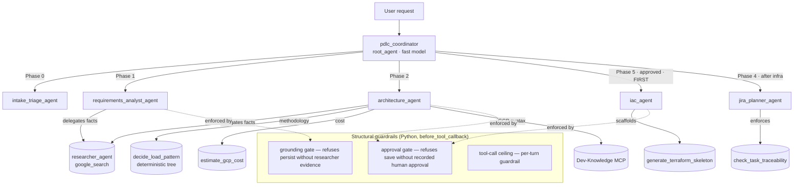

# Agentic PDLC Assistant — Pitch Deck

> **Gemini Enterprise Global Hackathon · Stream 2 (High-Code / Custom Agents & MCP)**
> **Team `agenti-1711` — Agentic PDLC**
> One markdown file, eight slides, the whole story: the problem, the solution, the
> architecture, the ROI, and where it goes next. Every claim here is grounded in code
> that exists in this repo — nothing is aspirational hand-waving.

---

## Slide 1 — The Team

**Team `agenti-1711` — "Agentic PDLC"**

| | |
|---|---|
| **Stream** | Stream 2 — High-Code / Custom Agents & MCP |
| **Sandbox** | `hl2-gcpp-ccoe-ge-h-agenti-1711` (EPAM Layer-2 GCP project) |
| **What we shipped** | A production-shaped multi-agent system on Google ADK, deployed to Cloud Run (A2A), registered into Gemini Enterprise |
| **The one-liner** | *We turned a senior data-engineering team's entire discovery-to-delivery playbook into an agent you can talk to.* |

> **Roles to fill on the slide:** Lead Architect · Agent/Tool Engineer · Platform/Deploy · Eval & QA. *(Add teammate names here.)*

---

## Slide 2 — The Problem

### The expensive, invisible bottleneck: the *front* of the data lifecycle

Everyone automates the *build*. Almost nobody automates the **thinking that has to happen
before the build** — and that thinking is where projects quietly hemorrhage time and money.

When a business stakeholder says *"we need a daily competitor stock tracker,"* a senior data
engineer doesn't open an IDE. They spend **days** doing unglamorous, high-skill work:

- **Triage** — is this net-new or does something adjacent already exist? How big is it really?
- **Requirement & feasibility analysis** — what does "competitor watch" even *mean* as a field
  list? Which stock API clears the rate-limit, latency, cost, and TOS bar? What's *missing*
  before anyone can safely build?
- **Architecture & HLD** — full vs. incremental vs. append-only load? Parquet or Delta? Which
  GCP pattern, and *what will it cost per month*? Every choice needs a defensible rationale.
- **Design review, JIRA breakdown, infra scaffolding** — turning an approved design into a
  traceable backlog and a runnable environment.

### Why this hurts (and why nobody fixes it)

| Pain | Consequence |
|---|---|
| **It's senior-only work.** | Your most expensive, most scarce people are stuck doing discovery instead of building. |
| **It's slow.** | Days of meetings, doc-writing, and API-doc spelunking *before the first line of pipeline code.* |
| **It's inconsistent.** | Two engineers produce two different designs. Quality depends on who caught the ticket. |
| **It's undocumented.** | The *why* behind decisions lives in someone's head or a lost Slack thread. Six months later nobody knows why it's Delta and not Parquet. |
| **LLMs make it worse, naively.** | A generic chatbot will confidently hallucinate a stock API's rate limit or invent Terraform syntax — turning a time problem into a *trust* problem. |

**The opportunity:** this phase is *perfectly shaped for agents* — each step has a well-defined
input and produces exactly one artifact (a triage note, a requirement doc, an ADR, a JIRA tree,
a Terraform file). It's structured knowledge work, not creative improvisation. **That's
automatable — if, and only if, you can make it trustworthy.**

---

## Slide 3 — The Solution

### An agent that runs the data-engineering PDLC like a real team — with a receipt for every decision

The **Agentic PDLC Assistant** takes a plain-language request and walks it through the entire
**Project Development Lifecycle**, producing the exact artifacts a senior team would — end to end,
in minutes instead of days.

```
"Build a daily competitor stock tracker"
        │
        ▼
 ┌──────────────────────────────────────────────────────────────────────┐
 │  Phase 0  Intake & Triage        → one-paragraph triage note          │
 │  Phase 1  Requirements + Gaps    → versioned Requirement Analysis      │
 │  Phase 2  Architecture & HLD     → GCP HLD + cost proposal + ADRs      │
 │  Phase 3  Design Review [GATE]   → approve / conditional / reject      │
 │  Phase 5  Infra-as-Code (FIRST)  → real Terraform in the repo          │
 │  Phase 4  JIRA Breakdown         → Epic→Feature→Story→Task + AC        │
 └──────────────────────────────────────────────────────────────────────┘
        │
        ▼
  A defensible paper trail + a runnable deliverable
```

### The three things that make it *enterprise-ready*, not a demo

**1. It's a team of specialists, not one know-it-all.**
A lightweight coordinator routes each request to a **narrow phase specialist** (Coordinator-
Dispatcher pattern). Limited-scope agents are more reliable and hallucinate far less than one
monolithic prompt. Five specialists, each owning one phase, each with only the tools it needs.

**2. It refuses to make things up — by construction.**
Every *factual* claim is **grounded in live research, never from memory**:
- Third-party vendor/API facts (a stock API's real rate limit) → a dedicated `google_search`-grounded **researcher sub-agent**.
- Google's own current docs (exact GCP / Terraform syntax) → the **Google Developer Knowledge MCP server**.
- The one genuinely-fixed methodology decision (the load-pattern choice) → a **deterministic decision tree**, not an LLM guess.
- Costs → a **labeled rough-order-of-magnitude calculator**, framed like a lead engineer proposing options with numbers.

**3. The guardrails are code, not vibes.**
The human-approval gate and the grounding requirement aren't polite instructions a model can
ignore — they're **`before_tool_callback` guards in Python that raise and refuse**. You cannot
save an architecture doc without a recorded human approval. You cannot persist a requirement
doc without evidence a researcher was actually consulted this session. *"We told it to check
docs"* becomes *"a run where it didn't cannot ship."*

### Who it helps

| Audience | Value |
|---|---|
| **Data engineers** | Days of discovery/design compressed to minutes; they start at the build, not the blank page. |
| **Engineering leads** | Consistent, defensible designs every time — with cost proposals attached. |
| **The business** | Faster time-to-data, and an auditable *why* behind every architecture choice. |
| **The enterprise** | A repeatable, governed lifecycle — speed *and* auditability *and* a runnable deliverable. |

---

## Slide 4 — The Architecture

### The stack

- **Framework:** Google **ADK 2.x** (`google-adk[gcp,otel-gcp,mcp]`), **A2A** protocol, FastAPI · Python 3.12
- **Toolchain (golden path):** Google **`agents-cli`** (scaffold → infra → deploy → eval), `uv`, `pytest`, Terraform, Docker
- **GCP:** Cloud Run · Vertex AI (Gemini) · Artifact Registry · Secret Manager · Cloud Trace · BigQuery (telemetry + Agent Analytics) · GCS
- **Grounding (GCP-native, real — not planned):** ADK `google_search` + **Google Developer Knowledge MCP**
- **Model routing:** a *fast* model for coordinator routing, a *reasoning* model (Gemini 2.5 Pro tier) for Phase-1 gap analysis and Phase-2 GCP design — cheap where it can be, strong where it must be.

### How it works — Coordinator-Dispatcher with grounded specialists



### The design principles that make it trustworthy

1. **Doc-before-code, structurally enforced.** No agent emits code, config, or an ADR "Decision"
   without a grounding step — enforced by a callback guard, not a prompt.
2. **Human-in-the-loop at the real gates** — requirement sign-off and architecture review are
   recorded decisions the flow cannot bypass.
3. **MCP-first for anything external; deterministic tools for fixed methodology.** The
   load-pattern decision tree is Python, not an LLM — because a *methodology* shouldn't drift.
4. **Every run traced; grounding is an eval gate, not a hope.** Cloud Trace captures every step;
   an `agents-cli eval` metric checks that grounding actually happened. Deterministic tools are
   tested with `pytest` (**38 passing, offline**); agent *behavior* is tested with `agents-cli eval` — never assert on LLM text in a unit test.

### Deployed, the golden-path way

```bash
agents-cli infra single-project     # Terraform: SA, IAM, Cloud Trace + BigQuery telemetry, Cloud Run shell
agents-cli deploy --project [PROJECT_ID] --region us-central1 \
  --service-account agentic-pdlc-app@[PROJECT_ID].iam.gserviceaccount.com   # --no-allow-unauthenticated
```

Then grant the Layer-1 Discovery Engine SA `roles/run.invoker` and register the deployed
`agent.json` into Gemini Enterprise (team-gated via support ticket in the hackathon).

---

## Slide 5 — The ROI

### The math: senior time is the product

Take one *typical* net-new data request. Conservative, defensible numbers:

| PDLC phase | Senior-engineer effort (manual) | With the Assistant |
|---|---|---|
| Intake & triage | 0.5 day | seconds |
| Requirement & feasibility analysis | 2–3 days | minutes |
| Architecture, HLD, cost, ADRs | 2–3 days | minutes |
| JIRA breakdown | 0.5–1 day | minutes |
| Infra scaffolding (Terraform) | 0.5–1 day | minutes |
| **Total discovery-to-backlog** | **~1.5–2 weeks** | **under an hour of human review** |

**Per request:** roughly **6–9 senior-engineer days** of discovery/design collapse into a short
review of pre-generated, grounded, traceable artifacts.

### Scaled ROI (illustrative — plug in your real rates)

- At a blended **$800/senior-day**, ~7 days saved per request ≈ **~$5,600 of engineering
  capacity freed per request.**
- A team fielding **~40 new data requests/year** → **~280 senior-days** reclaimed — well over a
  **full engineer-year of capacity**, redirected from discovery paperwork to actual building.
- Runtime cost to produce that is **cents-to-dollars of Vertex AI inference per request** — a
  three-to-four-orders-of-magnitude cost asymmetry.

### The ROI that isn't on the invoice

- **Consistency:** every design follows the same playbook — no more "depends who caught the ticket."
- **Auditability:** every choice traces to a requirement, a *researched* fact, or an ADR. When an
  auditor or a new hire asks *"why Delta not Parquet?"* — the answer is written down, with its reason.
- **Risk reduction:** grounded facts + structural guardrails mean the design is built on **verified
  API limits and real GCP syntax**, not a confident hallucination that detonates in Phase 5.
- **Governance built in:** least-privilege IAM, secrets in Secret Manager, `--no-allow-unauthenticated`,
  and a $100 cost-cap-aware design — enterprise controls from day one.

> **The pitch in one line:** *We don't just make the data lifecycle faster — we make it faster,
> cheaper, consistent, and auditable at the same time. That's the combination that turns a demo
> into something an enterprise will actually adopt.*

---

## Slide 6 — Next Steps

### What we'd build next

| Next feature | Why it matters |
|---|---|
| **Durable, multi-day human gates** | Today the approval gate lives in the chat session. An ADK graph `Workflow` with a durable human-input node survives restarts — enabling true async, multi-day approval flows across a real org. |
| **Live ticketing & docs (opt-in)** | The clean MCP seams mean real Jira ticket creation and Confluence publishing are a *single* configured MCP registration away — gated on Platform-Architect sign-off. |
| **Grounding eval in CI** | Wire the `agents-cli eval` grounding metric as a PR-blocking gate: a run where codegen skipped its doc-fetch *cannot merge*, exactly like a failing unit test. |
| **Cost-ceiling enforcement** | A hard stop when a traced run's cost exceeds its Phase-1 budget — real now that the $100 project cap makes it concrete. |
| **Multi-team pattern profiles** | Per-team stack profiles so the same harness serves teams with different golden architectures. |
| **Full unattended pipeline build** | Extend past design into Phase-5 code generation, so an approved design walks all the way to a working, tested pipeline + dashboard. |

### What "enterprise ready" needs

- **Identity & access:** SSO-scoped access in Gemini Enterprise, per-team least-privilege service accounts, full audit logging of who requested what.
- **Observability at scale:** the Cloud Trace + BigQuery Agent Analytics wiring exists — next is dashboards and alerting on grounding-failure and cost-anomaly signals.
- **Golden-path governance:** the org's architecture standard as a living, version-controlled source of truth the agents ground against (already modeled in `docs/architecture-standard-gcp.md`).
- **Human-in-the-loop SLAs:** durable gates + notifications so approvals fit real review cadences, not just a single chat session.

---

## Slide 7 — Lessons Learned

- **Narrow agents beat one genius agent.** The single biggest reliability win was *splitting* the
  monolith into scope-limited specialists. Less surface area = less hallucination.
- **"Ground your facts" has to be structural, not a prompt.** A model *told* to check docs will
  skip it under pressure. Moving the requirement into a `before_tool_callback` that *raises* was
  the moment the system became trustworthy instead of merely well-intentioned.
- **Know what should be deterministic.** A *methodology* decision (load pattern) belongs in a
  Python decision tree, not an LLM. Reserve the model's judgment for genuinely open-ended reasoning.
- **Test the right things the right way.** Deterministic tools → `pytest` (fast, offline, 38 green).
  Agent behavior → `agents-cli eval`. Trying to assert on LLM response text in a unit test is a
  trap we deliberately avoided.
- **Constraints sharpen the design.** The EPAM guardrails (GCP-native only, `--no-allow-unauthenticated`,
  $100 cap, no external SaaS without sign-off) forced a *cleaner* architecture — the MCP seams that
  keep external services opt-in are directly a product of that discipline.
- **The skills-first, dev-here / run-on-remote workflow held up.** Authoring locally and executing
  on an auth'd remote, with the vendored Google skills as the source of truth, kept us out of the
  deploy-and-registration failure modes that usually bite first-time ADK teams.

---

## Slide 8 — Visuals

*Drop screenshots / short clips into the deck here. Suggested shot list:*

1. **The end-to-end run** — a single Gemini Enterprise chat: raw request → triage → requirement
   doc → HLD + cost + ADRs → approval → Terraform → JIRA tree. One conversation, the whole lifecycle.
2. **The grounding guardrail firing** — attempt to save a doc *without* research → the callback
   refuses with `GroundingRequiredError`. Proof the guardrail is real code.
3. **The approval gate** — architecture save blocked until a human approval is recorded.
4. **A generated artifact** — the versioned Requirement Analysis (v1.0 → v1.1 changelog) or the
   Terraform file written into the repo, honestly flagging anything needing syntax verification.
5. **The cost proposal** — lightweight (Pattern D) vs. enterprise-Airflow (Pattern A) side by side,
   with rough monthly numbers.
6. **The architecture diagram** — the Coordinator-Dispatcher mermaid from Slide 4.
7. **Cloud Trace** — one nested trace per run keyed by `request_id`, every LLM/tool/doc-fetch step visible.

> **Live demo prompts (all wired today):**
> - *"Here's our raw request for a daily competitor stock tracker — what's missing before we can build?"*
> - *"Compare the cost of a lightweight vs enterprise-Airflow pattern for this volume."*
> - *"Full, incremental, or append-only for daily stock closes with corporate actions?"*
> - *"The architecture is approved — scaffold the infra for it."*

---

### Appendix — Why this is credible, not a slideware promise

Everything above traces to code in this repo:

| Claim | Where it lives |
|---|---|
| 5 phase specialists + coordinator | [`pdlc_agent/agent.py`](../pdlc_agent/agent.py), [`pdlc_agent/agents/`](../pdlc_agent/agents/) |
| `google_search`-grounded researcher | [`pdlc_agent/agents/researcher_agent.py`](../pdlc_agent/agents/researcher_agent.py) |
| Deterministic load-pattern decision tree | [`pdlc_agent/tools/load_pattern.py`](../pdlc_agent/tools/load_pattern.py) |
| Rough-order-of-magnitude cost calculator | [`pdlc_agent/tools/cost_estimate.py`](../pdlc_agent/tools/cost_estimate.py) |
| Structural approval + grounding guardrails | [`pdlc_agent/callbacks.py`](../pdlc_agent/callbacks.py) |
| Google Developer Knowledge MCP grounding | [`pdlc_agent/tools/dev_knowledge.py`](../pdlc_agent/tools/dev_knowledge.py) |
| Terraform scaffolding tool | [`pdlc_agent/tools/iac_generator.py`](../pdlc_agent/tools/iac_generator.py) |
| Deploy + telemetry infra | [`deployment/terraform/`](../deployment/terraform/) |
| Deterministic tool tests (38 passing) | [`tests/unit/`](../tests/unit/) |
| Eval harness (dataset + LLM-as-judge) | [`tests/eval/`](../tests/eval/) |
| The domain playbook this automates | [`docs/pdlc-playbook.md`](pdlc-playbook.md) |
| Full technical architecture | [`docs/architecture.md`](architecture.md) |
