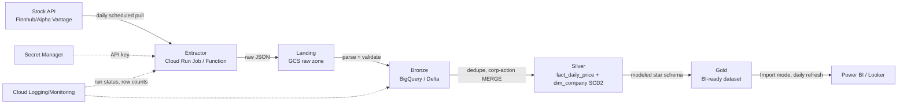

# The Data Engineering PDLC Playbook

**From "we need this data" to a production PR — every decision point, every question, worked through a real example.**

This is the domain ground-truth our agents automate. Each phase produces exactly one **artifact** (a doc, a diagram, a ticket tree, a PR). That constraint is deliberate: an agent can't "attend a discussion," but it can produce a Requirement doc, an ADR, a Mermaid diagram, or a JIRA tree when the inputs and output shape are well defined. The agentic harness that automates this is described in [architecture.md](architecture.md).

Running example throughout: **"Daily stock tracker for competitor watch."**

Five phases, one gate each:

```
Phase 0: Intake/Triage → Phase 1: Requirement & Feasibility → [GATE] →
Phase 2: Architecture/HLD → [GATE: Architecture Review] →
Phase 3: JIRA Breakdown → Phase 4: Build → Review → Deploy
```

---

## Phase 0 — Intake & Triage

A 5-minute sanity pass before any deep analysis. Answer immediately:

1. **Who is asking** — the actual end-user or a proxy? (Proxies lose nuance.)
2. **Net-new or does something adjacent exist?** (Existing competitor table? stock feed? PBI workspace?)
3. **Rough size** — a 2-day script or a multi-sprint platform build? Decides full process vs. spike.
4. **Urgency vs. importance** — is a deadline (earnings season, board meeting) constraining later architecture choices?

**Output:** one paragraph. Decide: proceed to full Phase 1, or fast-track as a spike.

*Stock tracker:* mid-size, net-new, ongoing monitoring → full Phase 1.

---

## Phase 1 — Requirement & Feasibility Analysis

Phase 1 always starts with incomplete information; you cannot get 100% of requirements right in one pass, so plan for a second round (the `v1.0 → v1.1` pattern).

### 1.1 End-user archetype (sets output format before any technical question)

| End-user type | Typical access pattern |
|---|---|
| Business user (competitor watch = this) | Dashboard / report — Power BI |
| Data analyst | SQL / flat file |
| Software engineer | API / SQL |
| External client | SFTP / cloud storage / API |

### 1.2 Business-side questions (before touching the API)

- **Business impact:** what decision does this drive? (Also sets acceptable latency.)
- **Semantic meaning:** what does "competitor watch" mean — price only? volume, market cap, volatility, sentiment? Get the literal field list.
- **Who are "the competitors"?** Fixed 5–10 tickers, or a dynamic set (turns the dimension into an SCD)?
- **Historical depth:** trend lines (needs history) or today's snapshot (doesn't)? Top-3 answer.
- **In / out of scope:** write down what is *not* being built. Scope-creep prevention starts here.

### 1.3 Source feasibility — the API deep-dive

| Question | Why it matters |
|---|---|
| Auth model (API key, OAuth2, rotating token)? | Determines secrets-management design in Phase 2 |
| Rate limit (per second/minute/day)? | Determines scheduler cadence, backoff, multi-key need |
| Pagination model (offset, cursor, page token)? | Determines extractor complexity |
| Delta queries (since-timestamp, cursor, changelog)? | **Decides full vs. incremental load** — see Phase 2 |
| Error/throttle behavior (HTTP code, retry-after, partial payload)? | Determines retry/backoff & idempotency |
| Free vs. paid tier ceiling and $/1000-call past it? | Determines viability without a budget ask |
| Data delay (real-time, 15-min, end-of-day)? | Must match the business-latency answer (1.2) |
| Schema stability (versioned? deprecation policy)? | Determines how defensively you parse |
| TOS — redistribution/dashboarding permitted? | Skipping this gets projects killed post-launch |

**Worked example — stock price sources (against current provider docs):**

| Provider | Free tier | Delay | Notes |
|---|---|---|---|
| Alpha Vantage | 25 req/day, 5/min | 15-min delay, daily bars | Broadest breadth (50+ indicators); tight daily cap |
| Finnhub | 60 req/min | ~20-min delay | Most generous free rate limit; good for scheduled polling |
| Twelve Data | 800 req/day | up to 4-hr on free | Best free daily volume; wide exchange coverage |
| Polygon.io | Very limited / none | — | Production-grade, pay-from-day-one |

For a **daily** tracker of ~10 tickers (~10 calls/day), any of Alpha Vantage, Finnhub, or Twelve Data clears the bar. The driver isn't rate limit at this volume — it's (a) which has the fields you need and (b) whether "15–20 min delayed daily close" is acceptable. Write the actual number against actual expected volume and show the headroom.

### 1.4 Consumption / output requirements

- Exact output schema — column names, types, grain (one row per company per day?).
- Refresh cadence **required by the dashboard**, separate from what the source *can* provide — they should match.
- Most-used filters (date range, ticker, sector) — quietly determines indexing/partitioning.
- Business-rule QA: what makes an end-user say "this number is wrong"? (e.g. close should never move >20% DoD without a known corporate action — flag it).

### 1.5 Non-functional requirements (forgotten → Phase-5 fire drills)

- **Security/compliance:** does this touch anything regulated (MNPI at a financial firm)? Explicit sign-off line.
- **Ownership:** who owns it post-launch, on-call expectation?
- **Cost ceiling:** approved monthly spend for API + compute + storage.
- **Retention:** how long history lives; legal min/max.

### 1.6 Requirement Analysis doc structure (versioned)

```
1. Business context & goal
2. End-users & access pattern
3. In-scope / Out-of-scope
4. Source evaluation (per candidate: auth, limits, cost, delay, verdict)
5. Output schema & refresh cadence
6. Non-functional requirements
7. Open questions (explicitly listed)
8. Sign-off log (who approved, what version, what date)
```

Ship v1.0 with an explicit **Open Questions** section; resolve in a working session; publish v1.1 with a visible changelog at the top. Never silently edit v1 — the delta *is* the decision record. No architecture work until sign-off.

### 1.7 Go/No-Go gate

Answer without hedging: (1) Is ≥1 source technically **and** commercially viable? (2) Is business impact worth the build cost? (3) Any TOS/compliance blockers? Any "no"/"unclear" → loop back to 1.2–1.3.

---

## Phase 2 — Architecture & HLD

Everything traces back to a specific Phase-1 answer. "We chose Delta because Phase 1 confirmed corporate-action price restatements happen" is a defensible ADR; "because it's trendy" is not.

### 2.1 Company patterns are a menu, not a mandate

| Pattern | GCP-native stack | Fits when… |
|---|---|---|
| D — Lightweight | Cloud Run Jobs + Cloud Scheduler + BigQuery | Small volume (10s–1000s rows/day), single source — most requests land here |
| B — Lakehouse (Dataflow) | Dataflow (Apache Beam) + GCS (Parquet) + BigLake/BigQuery ext tables | Big volumes, append-mostly, no merges needed |
| C — Lakehouse (Dataproc) | Dataproc (managed Spark) + GCS or BigQuery | Volumes genuinely need Spark-scale transforms |
| A — Enterprise DW | Managed Service for Apache Airflow (MSAA/Cloud Composer) + Dataform (or dbt-core) + BigQuery | Many pipelines already share a modeling layer/orchestrator |

A 10-ticker daily puller is Pattern-D scale. Using a heavier pattern for platform consistency is legitimate — but state it as a trade-off in the ADR, don't default into it. (Encoded deterministically for cost comparison in [`pdlc_agent/tools/cost_estimate.py`](../pdlc_agent/tools/cost_estimate.py) — a lead engineer proposes options with numbers, not just technical preference.)

**GCP-specific insight — don't miss this:** BigQuery natively supports MERGE/UPSERT. On GCP you often do NOT need a separate Delta/Iceberg lakehouse layer just for update-in-place semantics — landing data directly in BigQuery gives you that for free. Reserve the Dataflow/Dataproc lakehouse patterns for volumes that genuinely need Spark/Beam-scale processing, not merge support alone.

### 2.2 Decision tree — load pattern (highest-leverage HLD decision)

```
Is the source a MUTABLE STATE (customer record, company profile)
or an IMMUTABLE POINT-IN-TIME FACT (yesterday's closing price)?

├─ Mutable state
│   ├─ API exposes a delta signal (updated_since, cursor, changelog)?
│   │   ├─ Yes → INCREMENTAL LOAD (watermark) + MERGE/upsert
│   │   └─ No  → FULL LOAD each run, diff vs. yesterday (only if small)
│
└─ Immutable point-in-time fact (stock close IS this)
    ├─ One-time historical backfill? → FULL historical pull, once
    └─ Ongoing → APPEND-ONLY: pull only today's new fact, never overwrite history
                 EXCEPT: corporate actions (splits/dividends) retroactively
                 restate historical closes — the one case where "immutable"
                 facts still need MERGE. This is the concrete "Delta over Parquet" call.
```

*Stock tracker:* immutable-fact branch, append-only day-to-day, **except** corporate actions justify keeping MERGE capability. That's the ADR-worthy deviation — a named reason, not "just in case." (This decision tree is encoded deterministically in [`pdlc_agent/tools/load_pattern.py`](../pdlc_agent/tools/load_pattern.py).)

### 2.3 Storage format

- Pure append, no restatement risk → **Parquet** (cheaper to maintain).
- Any realistic retroactive update (our case) → **Delta/Iceberg** for MERGE on the fact table.

### 2.4 BI serving layer (an architectural decision, driven by volume + freshness)

```
Compressed dataset fits Import limits AND daily refresh acceptable?
├─ Yes → IMPORT MODE (fastest, full DAX, simplest). ← stock tracker
└─ No  → DIRECTQUERY (large/fresh) or COMPOSITE (Import dims, DirectQuery facts)
```

### 2.5 Data modeling — minimal star schema

- `fact_daily_price` — grain: (company, trading_date); measures OHLC + volume; MERGE for restatement.
- `dim_company` — ticker, name, sector; **SCD2** if the competitor list changes over time.
- `dim_date` — calendar (trading-day flag).

### 2.6 Cross-cutting NFR design

- **Security:** API key in Secret Manager (never in repo), least-privilege IAM, scoped read-only warehouse access.
- **Logging & monitoring:** structured logs per run (rows pulled/loaded, duration), freshness/health check, failure alert route.
- **Retry & idempotency:** exponential backoff on throttling; MERGE writes so re-running a failed day doesn't duplicate; safe re-run after mid-job failure.
- **Cost estimate:** rough monthly number (API + compute + storage). Write it down even when small — it's what makes the ADR defensible. (Deterministic ROM calculator: [`pdlc_agent/tools/cost_estimate.py`](../pdlc_agent/tools/cost_estimate.py) — always presented as an estimate, verify precisely via Cloud Billing.)

### 2.7 ADR template (one per significant, hard-to-reverse choice)

```
# ADR-00X: <short decision title>
Status: Proposed | Accepted | Rejected | Superseded
Context: <problem/constraint driving this>
Decision: <what was chosen>
Alternatives considered: <what else, and why not>
Consequences: <what this makes easier, harder, or forecloses>
```

Stock tracker expects ~3 ADRs: load-pattern/format, orchestration pattern, BI serving mode.

### 2.8 HLD diagram (worked example, Pattern D on GCP)



---

## Phase 3 — Architecture Review Gate

A real checklist, not a rubber stamp:

- [ ] Every choice traces to a Phase-1 requirement or a written ADR — no unexplained tech picks
- [ ] Cost estimate present and within budget
- [ ] Security: secrets handling, IAM scoping, data classification addressed
- [ ] Failure modes named: API down, rate-limited, bad data
- [ ] Serving-layer choice matches stated freshness (not over-/under-built)
- [ ] Deviation from standard pattern has a stated reason

Outcome: **approve**, **reject**, or **approve with conditions**. Rejected/conditional → back to Phase 2; the ADR log records what changed.

Once approved, the design is ready for its next step: **Infrastructure-as-Code scaffolding first**, then the JIRA breakdown (Phase 4) for the remaining development work. In this agentic implementation, the agent provisions real infra directly (Terraform for BigQuery/Secret Manager), so there is no need for a JIRA "set up the infra" ticket — by the time a team picks up the backlog, the environment already exists. (See [`pdlc_agent/tools/iac_generator.py`](../pdlc_agent/tools/iac_generator.py) — generates the infra it can verify the syntax for, and honestly flags what still needs a human/researcher to confirm rather than guessing it.)

---

## Phase 4 — JIRA Breakdown

```
Epic (whole tracker)
 └─ Feature (Ingestion, Modeling, Dashboard, Observability)
     └─ Story (user-facing increment, fits a sprint)
         └─ Task / Subtask (implementation-level)
```

Two things juniors miss:
1. **In the classic (manual) process, infra prerequisites are their own tasks, sequenced first** — API key + Secret Manager entry, IAM role, bucket/table creation, scheduler connection. In this agentic implementation the agent has already provisioned that infra as code (Phase 2→Gate→IaC scaffolding, before this phase runs) — so the breakdown below skips straight to the development work a team picks up against an environment that already exists.
2. **Every story/task has acceptance criteria traceable to a Phase-1/2 line item.** "Extractor pulls daily close for 10 tickers, retries 3× on 429 with backoff, writes to Bronze idempotently" is testable; "build the extractor" is not.

### Worked breakdown (abridged, infra already provisioned)

```
EPIC: Daily Stock Tracker for Competitor Watch
FEATURE: Ingestion
  - Story: pull daily close for the fixed 10-ticker list → Bronze daily.
    AC: retries on 429/5xx with backoff; idempotent re-run; logs row count.
FEATURE: Modeling
  - Story: one clean row per company per trading day in Silver, corp-action MERGE.
  - Task: fact_daily_price MERGE; dim_company SCD2; DQ checks.
FEATURE: Dashboard
  - Story: business user sees competitor price trends, refreshed daily.
FEATURE: Observability
  - Task: failure alert + freshness/row-count check.
```

---

## Phase 5 — Implementation → Review → Deploy

"PR merged" is not done.

**Resilience (baked into code):** idempotent writes (MERGE/upsert, never blind append on retry); exponential backoff sized to the real Phase-1 rate limits; schema validation at ingestion; checkpointing to resume from last success.

**Testing pyramid:** unit (transform/parse in isolation) · integration (extractor vs. mocked API) · e2e (full pipeline vs. sample data, validated against the Phase-1 output schema).

**Review & deploy:** code review against the JIRA acceptance criteria; promote dev → integration → UAT → production (never straight to prod); runbook written before go-live.

---

## Appendix A — Artifact / paper trail per phase

| Phase | Artifact produced |
|---|---|
| 0 | One-paragraph triage note |
| 1 | Requirement Analysis doc (versioned v1.0 → v1.1) |
| 2 | HLD doc: Mermaid diagram + ADR log + NFR section |
| 3 | Review decision record (approve / reject / conditional) |
| 4 | JIRA Epic → Feature → Story → Task tree, each with AC |
| 5 | PR(s), test results, runbook, deployment log |

This paper trail is exactly the set of well-defined inputs/outputs that lets an agent own each phase — which is what [architecture.md](architecture.md) builds.
